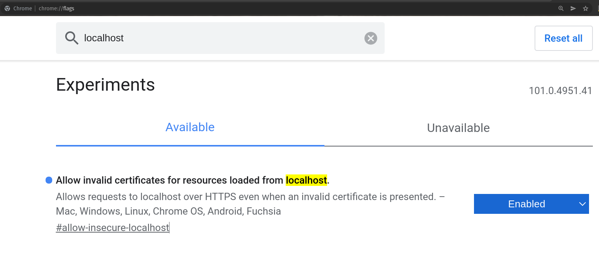
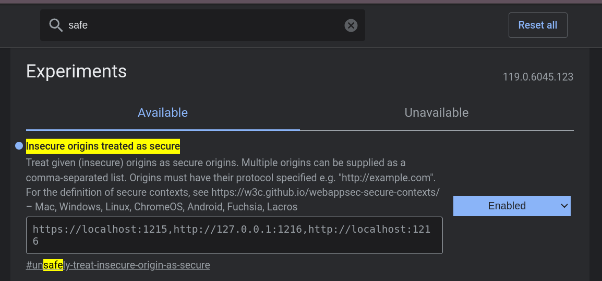

# PCSC AGNOSTIC DAEMON

Conjunto de herraminetas PCSC expuestas a través de una API REST

## PRE-REQUISITOS

- Soporte PCSC en el Sistema Operativo (ejemplo: Linux => pcsc-lite).
- Drivers PCSC de la lectora de tarjetas inteligentes.
- El binario puede ser compilado en Linux(4 or later), Windows(10 o or later), o MAC(OS).


## Compilación

1. Instalar GOLANG [https://go.dev/doc/install](https://go.dev/doc/install)

la versión mínima requerida es GOLANG 1.16

2. (PARA INSTALAR EL BINARIO SIN DESCARGAR EL PROYECTO) Instalación "directa" desde "go" con la instrucción:

`go install github.com/nebulaengineering/pcsc-agnostic-daemon/cmd/server@latest`

o si las variables de entorno de GOLANG no estan bien definidas:

`/usr/local/go/bin/go install github.com/nebulaengineering/pcsc-agnostic-daemon/cmd/server@latest`

El binario será instalado en el directorio "$GOPATH/bin" con el nombre original del paquete ("server" en este caso) "$GOPATH/go/bin/server. Se recomienda copiar el binario en la ruta de los binarios del usuario del sistema "~/bin" ("$HOME/bin").

Verifcar que el directorio "$HOME/bin" exista, y si no crearlo, verificar que en las variables de entorno del usuario exista un PATH apuntando al directorio "$HOME/bin/" (por ejemplo en el archivo "$HOME/.profile")

`cp $GOPATH/bin/server ~/bin/pcsc-agnostic-daemon`

o si las variables de entorno de GOLANG no estan bien definidas:

`cp ~/go/bin/server ~/bin/pcsc-agnostic-daemon`

3. Descargar el proyecto (SIGA EL RESTO DE INSTRUCCIONES SÓLO SI QUIERE DESCARGAR EL CÓDIGO FUENTE)

`git clone https://github.com/nebulaengineering/pcsc-agnostic-daemon.git`

4. Moverse al directorio del binario que será creado

`cd pcsc-agnostic-daemon/cmd/server`

5. Crear el binario

`go build -o pcsc-agnostic-daemon .`

6. (OPTIONAL) Copiar el binario en el directorio final desde el que será ejecutado. Ejemplo:

`cp pcsc-agnostic-daemon ~/bin/`


## Ejecución

A continuación se presentan las opciones de ejecución del binario.

- opciones:

```
pcsc-agnostic-daemon --help
Usage of pcsc-agnostic-daemon:
  -certpath string
    	[ssl enable required] path to certificate file, if this option wasn't defined the application will create a new certificate in "$HOME"
  -f	don't Create files if they don't exist?
  -keypath string
    	[ssl enable required] path to key file, if this option and "certpath" option weren't defined the application will create a new pair key in "$HOME"
  -port int
    	port in local socket to LISTEN (socket = localhost:port) (default 1216)
  -ssl
	enable ssl local service?
```


- Ejemplo de ejeución manual:

```
~/bin/pcsc-agnostic-daemon

pcsc-agnostic-daemon starting ...
pcsc-agnostic-daemon waiting for requests ...
```


Ingrese a la siguiente URL con un browser para verificar la correcta ejecuación del binario:

[http://localhost:1216/pcsc-daemon/readers](http://localhost:1216/pcsc-daemon/readers)

Debería ver un listado de lectoras PCSC conectadas.

Si se hace uso de las opción "-ssl" el certificado será creado automáticamente por el binario si no introduce un "path" de archivo para el certificado. Es posible que sea necesario agregar el certificado creado (por defecto en la ruta "$HOME/cert.pem") al sistema de confianza del sistema operativo (probablemente instalando el certificado en el sistema) y habilitar la confianza en certificados digitales autofirmados para localhost.

El puerto SSL por defecto, si se usa la opción "-ssl", es el puerto -1 (por defecto: 1216 - 1 = 1215)

Ejemplo de la habilitación de tráfico no seguro desde localhost en chrome:

[chrome://flags](chrome://flags)



En las nuevas versiones de Chrome la flag anterior ya no está disponible. Sin embargo es posible obtener el mismo resultado añadiendo las URL del demonio en una flag para sitio seguro:

[chrome://flags](chrome://flags)



Añada todas la URL que aparecen en la imagen (https://localhost:1215,https://127.0.0.1:1215,http://127.0.0.1:1216,http://localhost:1216)


## Script de inicio [opcional]

A continuación se expone un ejemplo de la configuración de un Script de Inicio para el binario "pcsc-agnostic-daemon" en un sistema operativo Ubuntu a través de "systemd".

premisas del ejemplo:

- Existe un usuario en el sistema con el username "test"
- El directorio "home" del usaurio "test" en el sistema es "/home/test"
- El binario "pcsc-agnostic-daemon" existe en la ruta "/home/test/bin/pcsc-agnostic-daemon" y tiene permisos de ejecución para el usuario "test".
- Hay un demonio de PCSC instalado en el sistema (ejemplo: `sudo apt-get install pcscd`).
- Los drivers de la lectora de tarjetas sin contacto están instalados en el sistema (ejemplo: `sudo apt-get install libacsccid1`). Es posible que sea necesario instalar los dirvers desde un "paquete" del fabricante de las lectoras. 

Script de inicio:

filename: /etc/systemd/system/pcsc-agnostic-daemon.service

```
# Simple service unit file to use for pcsc-agnostic-daemon
# startup configurations with systemd.
# By NebulaE
# Licensed under GPL V2
#

[Unit]
Description=PCSC local API REST

[Service]
Type=simple
Restart=always
RestartSec=3
User=test
ExecStart=/home/test/bin/pcsc-agnostic-daemon

[Install]
WantedBy=multi-user.target
```

Iniciar manualmente el Script en el sistema:

```systemctl start pcsc-agnostic-daemon.service```

Detener manualmente el Script en el sistema:

```systemctl stop pcsc-agnostic-daemon.service```

Habilita la ejecuación automática del Script cuando se inicie el sistema:

```systemctl enable pcsc-agnostic-daemon.service```

Revisar el estado del Script:

```systemctl status pcsc-agnostic-daemon.service```


